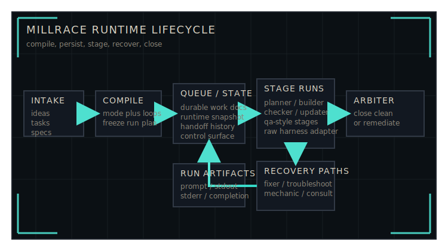

# Millrace

[](https://pypi.org/project/millrace-ai/)
[](https://www.python.org/downloads/)
[](LICENSE)


## Other agents win sprints. Millrace wins marathons.

Raw agent harnesses - Codex, Claude Code, Gemini - are built for sprints. Give
them a tight spec in a greenfield repo, let them rip, ship the result. They are
very good at this.

Millrace starts where those runs end. When the work spans sessions,
accumulates state, needs to survive a crash without losing context, or has to
gate on real acceptance criteria rather than "the agent said it was done",
that is the problem Millrace was built for.

Millrace is a governed runtime for long-running agent work. The harness still
does the local stage work. Millrace owns the queue, the compiled plan, runtime
state, recovery paths, and closure behavior around that work.

## Runtime Lifecycle



Millrace does not try to replace raw harness reasoning with a thicker prompt.
It wraps long-horizon work in a real runtime:

- intake lands work into a durable `millrace-agents/` workspace contract
- compile freezes the active mode and loop assets into a persisted run plan
- stage runs progress through explicit planning, execution, QA, and closure
  boundaries instead of one continuous chat
- recovery stages keep failures inside the workflow rather than just exiting
- backlog drain routes into Arbiter, which decides whether the product really
  clears or needs remediation

The shipped core already includes separate planning and execution loops, typed
terminal results, compiler-governed completion behavior, and persisted run
artifacts for post-run inspection.

## Early Proof

Millrace already has a useful public benchmark, and the right read is not
"Millrace already beats raw Codex on absolute final quality." The useful read
is that framework-driven orchestration is already competitive on hard,
long-horizon work while being much more efficient.

On the first substantive public A/B benchmark, both systems were aimed at the
same target: a parity-first modern Fabric port of Aura Cascade, a ten-year-old
Minecraft mod. The stronger direct-agent condition, raw Codex on `gpt-5.4`
`xhigh`, finished at `95 / 100`. Millrace, running as a staged daemon workflow
on routed `gpt-5.3-codex` `high` / `xhigh`, finished at `94 / 100`.

| Metric | Raw Codex | Millrace |
|------|------:|------:|
| Final score | `95 / 100` | `94 / 100` |
| Total tokens | `1,071,700,018` | `241,046,303` |
| Wall-clock span | `72h 23m 20.320s` | `28h 02m 36.972s` |
| Active runtime | `18h 04m 07.914s` | `12h 36m 15.515s` |

That means raw Codex used about `4.45x` Millrace's total tokens, took about
`2.58x` the wall-clock span, and still used about `1.43x` Millrace's active
runtime.

That wall-clock gap is not pure model speed. The raw Codex run needed repeated
manual continuation prompts whenever the operator was away from the keyboard,
while Millrace kept progressing through a staged runtime. Even after accounting
for that, the active-runtime gap still favors Millrace.

Read the full public evidence pack here:

- [codex-vs-millrace-mc-mod](https://github.com/tim-osterhus/codex-vs-millrace-mc-mod)

## How Millrace Fits With Raw Harnesses

Millrace is not a replacement for Codex, Claude Code, Aider, or similar raw
agent harnesses. It is the runtime layer you put around them when the work is
too long-running, stateful, or recovery-sensitive to trust to a single session.

Think of the split this way:

- the raw harness reasons locally, edits code, and emits a stage result
- Millrace decides which stage runs next and what contract that stage receives
- Millrace persists queue state, runtime snapshots, artifacts, and recovery
  context after each handoff
- the operator or ops agent decides when work enters the runtime and how the
  workspace is configured

If a direct Codex or Claude Code session is enough, use the direct session.
Millrace matters when the work has crossed out of sprint territory.

## When To Use Millrace

Use Millrace when:

- the work will outlast a single agent session
- you want explicit stage gates instead of "done enough" chat conclusions
- recovery and resumability matter
- you need durable state, queue artifacts, and run history under
  `<workspace>/millrace-agents/`
- completion has to clear a real closure pass rather than informal optimism
- an operator or ops agent is intentionally managing intake and runtime control

Do not use Millrace when:

- the task is small, bounded, and cleanly handled in one direct session
- the work is exploratory and governance would add more overhead than value
- single-session throughput matters more than persistence and recovery
- nobody is available to manage runtime configuration, intake, and workspace
  hygiene

## 60-Second Proof

Install:

```bash
pip install millrace-ai
```

Then point Millrace at a workspace:

```bash
export WORKSPACE=/absolute/path/to/your/workspace

millrace compile validate --workspace "$WORKSPACE"
millrace run once --workspace "$WORKSPACE"
millrace status --workspace "$WORKSPACE"
```

That flow proves four things quickly:

- Millrace can bootstrap its workspace contract under `millrace-agents/`
- the selected mode and loops compile into a frozen plan before execution
- the shipped `standard_plain` mode freezes closure behavior into that plan
- the runtime can execute a deterministic tick and report persisted status

## Read By Journey

### Start Here

- `docs/runtime/README.md`
- `docs/skills/millrace-ops-agent-manual/SKILL.md` if you are operating
  Millrace as an agent

### Run It

- `docs/runtime/millrace-cli-reference.md`
- `docs/runtime/millrace-runtime-architecture.md`

### Understand It

- `docs/runtime/millrace-compiler-and-frozen-plans.md`
- `docs/runtime/millrace-modes-and-loops.md`
- `docs/runtime/millrace-arbiter-and-completion-behavior.md`
- `docs/runtime/millrace-runner-architecture.md`

### Extend It

- `docs/runtime/millrace-entrypoint-mapping.md`
- `docs/runtime/millrace-loop-authoring.md`
- `docs/skills/millrace-loop-authoring/SKILL.md`
- `docs/source-package-map.md`

## Status

Millrace ships as a maintained pre-1.0 runtime line. If you depend on exact
behavior, pin to a patch version and verify against the current CLI and docs
rather than assuming every newer build is identical.

## License

See `LICENSE`.
