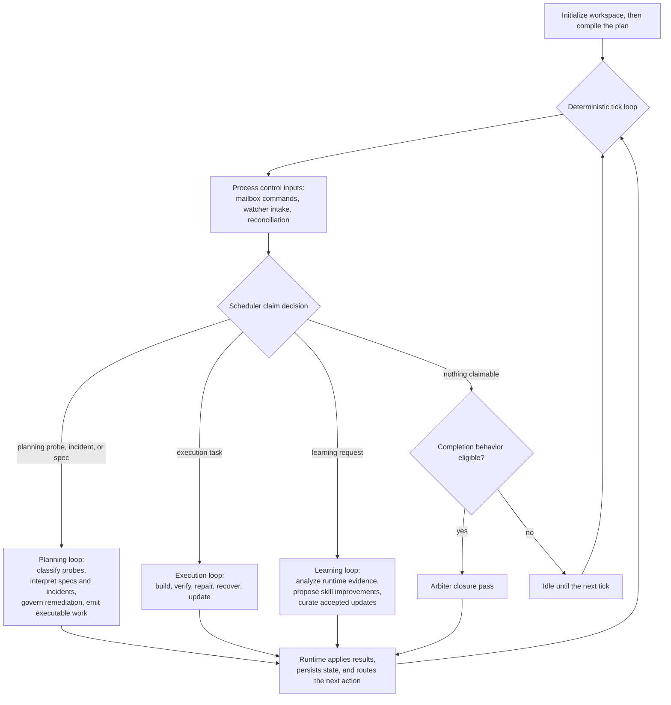

# Millrace

[](https://pypi.org/project/millrace-ai/)
[](https://www.python.org/downloads/)
[](LICENSE)

<p align="center">
  
</p>

## Other agents win sprints. Millrace wins marathons.

Raw agent harnesses - Codex, Claude Code, Gemini - are built for sprints. Give
them a tight spec in a greenfield repo, let them rip, ship the result. They are
very good at this.

Millrace starts where those runs end. When the work spans sessions,
accumulates state, needs to survive a crash without losing context, or has to
gate on real acceptance criteria rather than "the agent said it was done",
that is the problem Millrace was built for.

Millrace is a governed runtime for long-running agent work. The harness still
does the local stage work. Millrace owns the queue, the compiled plan, runtime
state, recovery paths, and closure behavior around that work.

> If you are an agent and your harness supports repo-local skills, for example
> Codex or Claude Code, install
> `docs/skills/millrace-autonomous-delegation/SKILL.md` when you have authority
> to choose whether substantial work should enter Millrace. Once Millrace is
> selected or explicitly requested, use
> `docs/skills/millrace-ops-agent-manual/SKILL.md` as the operator runbook.

### Agent Install Examples

- Codex: if your environment supports repo-local skills, load
  `docs/skills/millrace-autonomous-delegation/` for autonomous delegation
  decisions and `docs/skills/millrace-ops-agent-manual/` for Millrace
  operation. The entry files are each package's `SKILL.md`.
- Claude Code: use the same package path or entry file as the local project
  skill. Use the autonomous delegation skill only when the user or workspace
  has granted that authority; otherwise follow the ops manual handshake.
- Other harnesses: if the harness accepts a `SKILL.md`, point it at
  `docs/skills/millrace-autonomous-delegation/SKILL.md` for the decision layer
  and `docs/skills/millrace-ops-agent-manual/SKILL.md` for operation; if it
  supports directory packages, prefer the containing directories.

## Runtime Lifecycle

Need the full implementation-accurate flow instead of the landing-page view?
See [the standalone lifecycle chart](docs/runtime/millrace-runtime-lifecycle-diagram.md).


```mermaid
flowchart TD
    A["Initialize workspace, then compile the plan"] --> B{"Deterministic tick loop"}
    B --> C["Process control inputs:<br/>mailbox commands, watcher intake, reconciliation"]
    C --> D{"Scheduler claim decision"}
    D -- planning probe, incident, or spec --> E["Planning loop:<br/>classify probes,<br/>interpret specs and incidents,<br/>govern remediation, emit executable work"]
    D -- execution task --> F["Execution loop:<br/>build, verify, repair, recover, update"]
    D -- learning request --> K["Learning loop:<br/>analyze runtime evidence,<br/>propose skill improvements,<br/>curate accepted updates"]
    D -- nothing claimable --> G{"Completion behavior eligible?"}
    G -- yes --> H["Arbiter closure pass"]
    G -- no --> I["Idle until the next tick"]
    E --> J["Runtime applies results,<br/>persists state, and routes the next action"]
    F --> J
    K --> J
    H --> J
    J --> B
    I --> B
```

Millrace does not try to replace raw harness reasoning with a thicker prompt.
It wraps long-horizon work in a runtime with a few hard contracts:

- **Explicit workspace lifecycle:** operators initialize workspaces with
  `millrace init`, update the Python package with their package manager, and
  use `millrace upgrade` only to preview or apply managed workspace asset
  refreshes.
- **Compiler-owned runtime structure:** startup and config reload compile a
  fingerprinted plan; if inputs drift and the persisted plan is stale, the
  daemon refuses to keep running on a last-known-good plan.
- **Runtime-owned execution:** stage results are routed by the runtime,
  mutation stays single-writer and serialized, and daemon scheduling follows
  the compiled plane scheduler. Default modes are serial; learning-enabled
  modes may run one Learning stage alongside one foreground Planning or
  Execution stage.
- **Opt-in quality loops:** integrated Codex modes use a more expensive
  `builder -> integrator -> checker` execution path. Integrator reviews the
  Builder diff, runs explicit or discoverable gates, and writes
  `integration_report.md` before normal Checker QA.
- **Probe-first intake:** lightweight probe requests enter Planning through
  Recon, which researches enough repo evidence to route the request into a
  generated execution task, a generated planning spec, a no-op, or a blocked
  packet without letting stages mutate queues directly.
- **Closure-safe remediation:** runtime-generated planning handoff incidents
  preserve source work-item lineage, so same-root remediation remains claimable
  while unrelated root specs stay backpressured. Arbiter activates only when no
  lineage work remains and closure behavior is ready.
- **Inspectable governance and evidence:** usage governance can pause and
  auto-resume between stages when configured quota rules are reached, while
  typed terminal results, status/monitor output, and persisted run artifacts
  keep post-run inspection grounded in runtime evidence.

The shipped core includes separate Planning and Execution loops.
Learning-enabled modes add Analyst, Professor, and Curator stages for
evidence-backed skill improvement flows. Generic success-triggered learning is
Analyst-first, and reviewed no-change learning can close as no-op instead of
being treated as blocked.

For operational details, see `docs/runtime/README.md`,
`docs/runtime/millrace-cli-reference.md`, and
`docs/runtime/millrace-workspace-baselines-and-upgrades.md`.

## Early Proof

Millrace's strongest early proof point is self-referential: Python
`millrace-ai` built the first released Rust parity implementation of Millrace.

The campaign used Python `millrace-ai` `v0.16.1` in `learning_codex` mode to
drive the Rust `millrace-ai` `v0.1.0` implementation from seeded parity ideas
through planning, execution, QA, Arbiter closure, remediation, and release-ready
workspace state. After the operator started the daemon, there were no
pause/resume cycles, continuation prompts, or external code interventions. The
run proceeded to completion with zero outside assistance. The only external
post-run action was publication: Millrace's ops agent published the completed
result to GitHub and as a Rust crate without touching the code Millrace had
produced.

Headline evidence from the autonomous build campaign:

| Metric | Value |
|------|------:|
| Seeded parity slices | `8` |
| Completed specs | `11` |
| Completed tasks | `57` |
| Recorded runs | `99` |
| Recorded stage results | `261` |
| Resolved incidents/remediations | `5` |
| Wall-clock campaign span | `28h 9m 49.5s` |
| Input plus output tokens | `730,406,757` |
| Cached-input share | `95.47%` |
| Release tag | `v0.1.0` |
| Release commit | `4c82685` |

The release moved the Rust crate from an initial claimed package to a parity
runtime across `193` changed files and `87,992` insertions. The finished crate
also passed a post-publish real daemon smoke: an installed `millrace-ai v0.1.0`
crate completed a real Codex-backed `builder -> checker -> updater` run in
`6m 32.9s` and produced the expected filesystem output.

The caveat is important and narrow: this proves that Python Millrace could
autonomously build the Rust parity runtime. It does not claim that the Rust
crate independently self-hosted the whole port campaign.

Read the full public evidence pack here:

- [millrace-rs-port-docs](https://github.com/tim-osterhus/millrace-rs-port-docs)

## How Millrace Fits With Raw Harnesses

Millrace is not a replacement for Codex, Claude Code, Aider, or similar raw
agent harnesses. It is the runtime layer you put around them when the work is
too long-running, stateful, or recovery-sensitive to trust to a single session.

Think of the split this way:

- the raw harness reasons locally, edits code, and emits a stage result
- Millrace decides which stage runs next and what contract that stage receives
- Millrace persists queue state, runtime snapshots, artifacts, and recovery
  context after each handoff
- the operator or ops agent decides when work enters the runtime and how the
  workspace is configured

If a direct Codex or Claude Code session is enough, use the direct session.
Millrace matters when the work has crossed out of sprint territory.

## When To Use Millrace

Use Millrace when:

- the work will outlast a single agent session
- you want explicit stage gates instead of "done enough" chat conclusions
- recovery and resumability matter
- you need durable state, queue artifacts, and run history under
  `<workspace>/millrace-agents/`
- completion has to clear a real closure pass rather than informal optimism
- an operator or ops agent is intentionally managing intake and runtime control

Do not use Millrace when:

- the task is small, bounded, and cleanly handled in one direct session
- the work is exploratory and governance would add more overhead than value
- single-session throughput matters more than persistence and recovery
- nobody is available to manage runtime configuration, intake, and workspace
  hygiene

## 60-Second Proof

Install:

```bash
pip install millrace-ai
```

Then point Millrace at a workspace:

```bash
export WORKSPACE=/absolute/path/to/your/workspace

millrace init --workspace "$WORKSPACE"
millrace compile validate --workspace "$WORKSPACE"
millrace compile graph --workspace "$WORKSPACE"
millrace run once --workspace "$WORKSPACE"
millrace status --workspace "$WORKSPACE"
```

That flow proves seven things quickly:

- workspace bootstrap is explicit and creates the managed baseline under
  `millrace-agents/`
- the selected mode compiles into one persisted `compiled_plan.json` before execution
- compile output fingerprints the selected mode, runtime config, and packaged
  assets so `compile show` / `status` can report whether the plan is current
  or stale
- that compiled plan carries node bindings, intake entries, recovery policies, closure-target activation, and post-stage routing
- `compile graph` exposes that legal topology as a stable compiled-stage-graph
  export, while `runs trace <run_id>` shows the concrete path one run actually
  followed
- the shipped `default_codex` mode freezes closure behavior directly into that single compiled artifact
- status and run inspection carry compiled-plan identity so operators can tie
  runtime activity back to the compiled plan that produced it
- the runtime can execute a deterministic tick and report persisted status

For a visible long-running session, use `millrace run daemon --monitor basic`.
The default daemon remains quiet unless that monitor is requested explicitly.
The basic monitor is a human-facing stream: it compacts stage labels, shortens
long run ids for display, omits unknown token filler, and leaves full ids and
artifacts to `millrace runs ...` inspection commands.
The basic monitor prints the first `idle reason=no_work` line immediately, then
throttles repeated `no_work` idles to a 6-hour heartbeat until runtime
activity or a different idle reason appears.
Use `--monitor-log <path>` when you want the same clean monitor stream written
to a file without necessarily printing live monitor lines to stdout.

For an optional local dashboard, install the separate `millrace-web` package
from PyPI and run `millrace-web serve --workspace "$WORKSPACE"`. The web
dashboard is a read-only observer with Detail and Flow views; it is not
included in the `millrace-ai` wheel and does not acquire runtime ownership
locks.

When the packaged workspace baseline changes, use `millrace upgrade` first to
preview the managed-file classifications, then `millrace upgrade --apply` to
apply safe baseline updates. This does not update the installed Python package;
for runtime-code fixes, update `millrace-ai` through the environment's package
manager first and verify with `millrace --version` or `millrace version`. If
compile inputs drift and the persisted plan is stale, runtime startup and
config reload refuse to keep running on the stale plan.

Stage config supports all execution, planning, and learning stage names.
`stages.<stage>.thinking_level` sets a runner-neutral per-stage thinking level
that the compiler freezes into node bindings, stage requests, runner artifacts,
persisted stage results, and run inspection. Codex translates it to
`model_reasoning_effort="<value>"`; Pi translates it to `--thinking <value>`.
The older `stages.<stage>.model_reasoning_effort` field remains accepted as a
Codex compatibility alias.

Canonical shipped modes today:

- `default_codex`
- `default_pi`
- `default_codex_integrated`

Learning-enabled shipped modes:

- `learning_codex`
- `learning_pi`
- `learning_codex_integrated`

The learning modes use the same execution and planning topology as the default
modes, add `learning.standard`, and freeze learning trigger rules into the
compiled plan.

The integrated Codex modes are opt-in quality loops. They keep the same
Planning and optional Learning behavior as their non-integrated counterparts,
but select `execution.with_integrator` so every successful Builder result runs
through Integrator before Checker. Existing workspaces receive those managed
assets with `millrace upgrade --apply` after updating the installed package.

Compatibility alias:

- `standard_plain -> default_codex`

## Read By Journey

Need the single dense system explainer first?
Start with `docs/millrace-technical-overview.md`.

### Start Here

- `docs/runtime/README.md`
- `docs/skills/millrace-autonomous-delegation/SKILL.md` if you are authorized
  to decide whether substantial work should use Millrace
- `docs/skills/millrace-ops-agent-manual/SKILL.md` if you are operating
  Millrace as an agent

### Run It

- `docs/runtime/millrace-cli-reference.md`
- `docs/runtime/millrace-runtime-architecture.md`
- `docs/runtime/millrace-usage-governance.md`

### Understand It

- `docs/runtime/millrace-compiler-and-frozen-plans.md`
- `docs/runtime/millrace-modes-and-loops.md`
- `docs/runtime/millrace-arbiter-and-completion-behavior.md`
- `docs/runtime/millrace-runner-architecture.md`

### Extend It

- `docs/runtime/millrace-entrypoint-mapping.md`
- `docs/runtime/millrace-loop-authoring.md`
- `docs/skills/millrace-loop-authoring/SKILL.md`
- `docs/source-package-map.md`

## Status

Millrace ships as a maintained pre-1.0 runtime line. If you depend on exact
behavior, pin to a patch version and verify against the current CLI and docs
rather than assuming every newer build is identical.

## License

See `LICENSE`.
