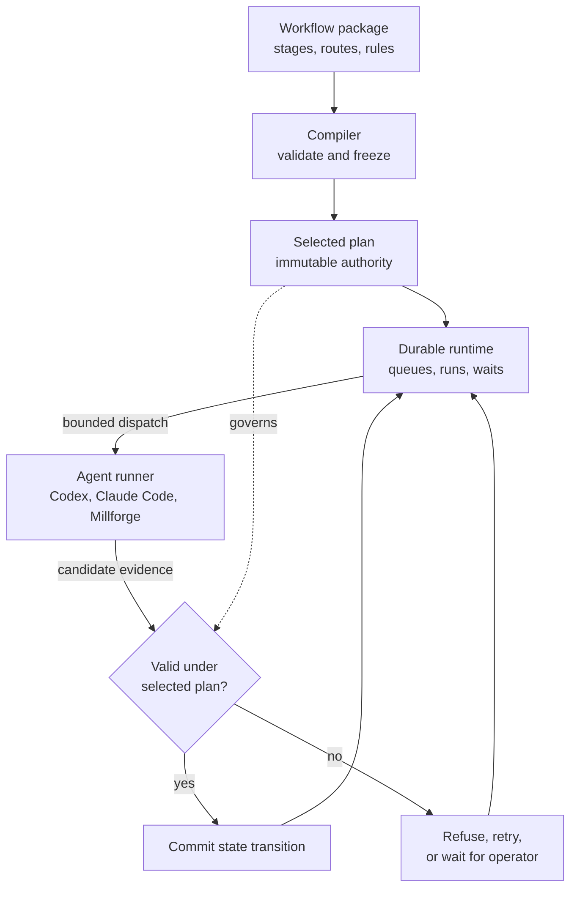

  

    
    
    
  

  
  <h1>Millrace</h1>

Ever find yourself doing the same thing over and over with AI agents?

You construct the plan. You tell it to execute the plan, then you have another
agent check the first agent's work. It finds issues, so you tell it to fix
those issues. Any time a new blocker comes up, you ask it to troubleshoot the
issue and fix it before moving on. You rinse and repeat until there's no more
bugs and everything matches the initial plan.

All you did was manage which agent performs which role at which time. If you
sketched out the entire process on paper, you'd find it's just a manually-driven
decision tree. An agent can generally be relied upon to execute any single
step on its own, but owning the entire workflow end to end? No agent is owning
that reliably (yet). And this is where Millrace comes in.

```mermaid
flowchart TD
    W["Workflow package<br/>stages, routes, rules"] --> C["Compiler<br/>validate and freeze"]
    C --> P["Selected plan<br/>immutable authority"]
    P --> R["Durable runtime<br/>queues, runs, waits"]
    R -->|"bounded dispatch"| A["Agent runner<br/>Codex, Claude Code, Millforge"]
    A -->|"candidate evidence"| V{"Valid under<br/>selected plan?"}
    P -.->|"governs"| V
    V -->|"yes"| T["Commit state transition"]
    T --> R
    V -->|"no"| X["Refuse, retry,<br/>or wait for operator"]
    X --> R
```

If your workflow can be described as a decision tree, it can be turned into
a plan by Millrace. Completion moves to the next step, failure moves to
bugfixing, and a hard blocker escalates to automated recovery. You can have
as many recovery mechanisms or branching paths as you like, and the compiler
makes sure you're only running valid plans.

For more information, check out the
[FAQ](https://github.com/tim-osterhus/millrace/blob/main/FAQ.md).

## Start With Your Agent

Millrace is **agent-first**. Give this repository to a capable local agent:

> Install Millrace for me in this workspace using
> https://github.com/tim-osterhus/millrace. Read its README and
> [instruction manual](https://github.com/tim-osterhus/millrace-plus/blob/v0.22.0/src/millrace_plus/skills/millrace-instruction-manual/SKILL.md)
> first. Check the CLI, workspace, workflows, and runners. Report what you
> installed and what you need next. Do not store credentials in workflow
> assets or start unattended work.

Then delegate work:

> Use Millrace to govern this work: `<goal and constraints>`. Choose an
> official workflow, explain why, start with a bounded run, and report the
> selected plan, state, waits, and evidence.

Manual setup is documented in
[Getting started](https://github.com/tim-osterhus/millrace/blob/main/docs/getting-started.md).

## Runtime Rules

- The selected plan defines legal stages, routes, assets, runners, and outcomes.
- Queues, runs, waits, traces, and artifacts survive restarts.
- Each stage receives only its selected assets and context.
- Model output is evidence, not runtime truth.
- Retries, reroutes, pauses, and operator decisions remain on record.
- Operator dispatch suspension gates only new claim acceptance. Already
  accepted or active work keeps its durable authority.
- Queue cancellation closes eligible workflow work through the normal audited
  close-work transition. It never deletes queue state or signals a runner.
- Supported commands change state; direct file edits do not.

## Workflows

`millrace-plus` provides:

- `simple_loop`: plan, run, review, and bounded recovery;
- `lean_agentic_development`: full end-to-end autonomous agentic engineering;
- `vendor_selection`: policy checks, parallel evaluation, and an operator gate.

These are package data, not hard-coded kernel behavior.

## Documentation

[Getting started](https://github.com/tim-osterhus/millrace/blob/main/docs/getting-started.md) ·
[How Millrace works](https://github.com/tim-osterhus/millrace/blob/main/docs/how-millrace-works.md) ·
[Runner-session architecture](docs/runner-session-architecture.md) ·
[Daemon lifecycle](docs/daemon-lifecycle.md) ·
[Workflow packages](https://github.com/tim-osterhus/millrace/blob/main/docs/workflow-packages.md) ·
[Millforge runner](https://github.com/tim-osterhus/millrace/blob/main/docs/millforge-runner.md) ·
[Codex runner](https://github.com/tim-osterhus/millrace/blob/main/docs/codex-runner.md) ·
[Errors](https://github.com/tim-osterhus/millrace/blob/main/docs/errors.md) ·
[Migrating from v0.21](https://github.com/tim-osterhus/millrace/blob/main/docs/migrating-from-v0.21.md) ·
[v0.22 support](https://github.com/tim-osterhus/millrace/blob/main/docs/v0.22-compatibility.md)

Millrace v0.22 is local and single-operator. It supports Linux, macOS, and WSL.

## License

[Apache License 2.0](https://github.com/tim-osterhus/millrace/blob/main/LICENSE)
