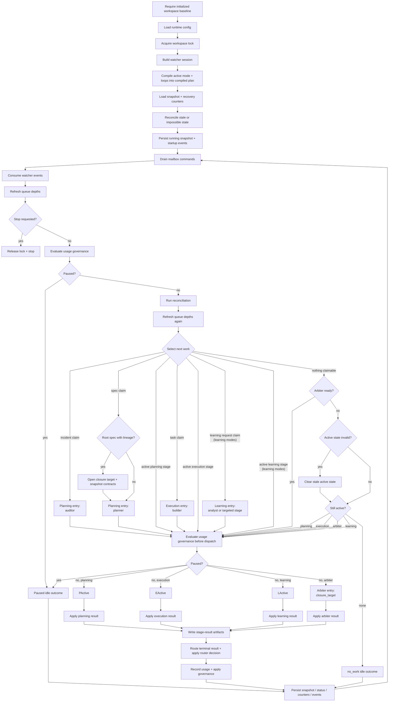
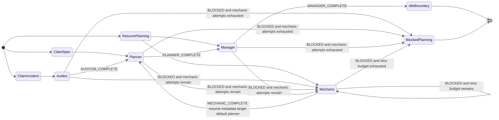
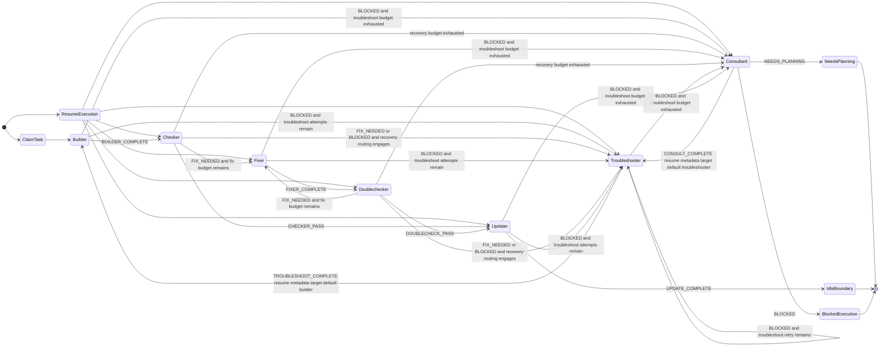
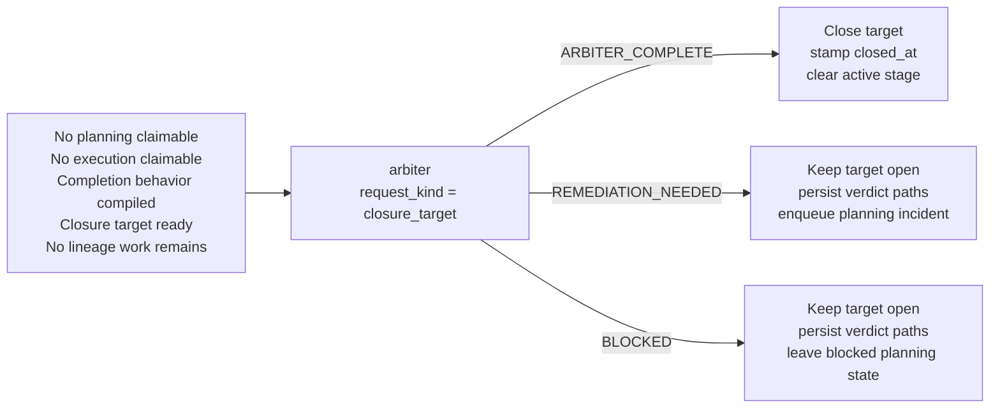

# Millrace Runtime Lifecycle Diagram

This is the dense, implementation-accurate lifecycle chart for the shipped
default runtime configuration:

- mode: `default_codex`
- planning loop: `planning.standard`
- execution loop: `execution.standard`

Learning-enabled modes (`learning_codex`, `learning_pi`) use the same planning
and execution topology and add `learning.standard`; this default-mode chart
omits that optional claim path except where noted.

The README embeds a simplified version. This file keeps the fuller chart that
tracks startup, scheduling, result application, recovery routing, and Arbiter
activation more faithfully.

## Overview

## Planning Loop Detail

## Execution Loop Detail

## Arbiter Detail

## Notes

1. Require an initialized workspace baseline; create it with `millrace init`.
2. Load runtime config.
3. Acquire workspace lock.
4. Build watcher session.
5. Compile active mode and loops into a compiled plan.
6. Load snapshot and recovery counters.
7. Reconcile stale or impossible state.
8. Persist running snapshot and startup events.

- Drain mailbox commands first on every tick.
- Explicit config reload is what recompiles the compiled plan.
- Consume watcher events and normalize ideas into queued specs.
- Refresh queue depths, run stop and usage-governance pause checks, then
  reconcile.
- Refresh queue depths again before claim or activation.
- Re-check usage governance immediately before stage dispatch.
- Exactly one stage runs per tick at most.
- Usage governance can pause before claim/dispatch and records stage-result
  token usage after routing.
- Active stages can bypass fresh claim and go straight to request build.
- Claim precedence is planning incident -> planning spec -> execution task,
  then learning request when a learning loop is active.
- Root-spec claim opens the closure target and snapshots contracts.
- Arbiter activates only when no lineage work remains and closure is ready.
- Invalid active state is cleared before the runtime settles on `no_work`.
- Normalize and persist the stage result.
- Write stage-result artifacts.
- Route terminal status.
- Mark tasks, specs, or incidents done or blocked.
- Mark learning requests done or blocked when the learning plane is active.
- Update recovery counters and closure-target state.
- Record stage token usage into the governance ledger and apply any resulting
  between-stage pause.
- The runtime, not the stage, owns authoritative state mutation.

Key invariants preserved by this chart:

- compile happens at startup and again only on explicit config reload
- planning and execution are separate claim domains inside one scheduler, not
  concurrent lanes
- learning-enabled modes add learning requests and status markers, while the
  current tick executor still runs at most one active stage per tick
- the runtime applies stage results and mutates authoritative state after each
  execution; stages do not own queue mutation directly
- `manager`, `updater`, and successful Arbiter outcomes return the runtime to
  an idle or claim boundary for the next tick
- Arbiter is a completion-behavior activation path, not a normal queued work
  item handoff
