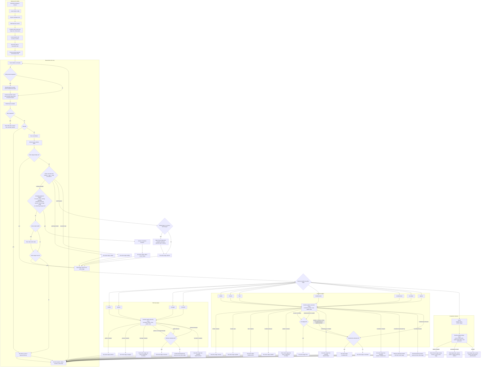

# Millrace Runtime Lifecycle Diagram

This is the dense, implementation-accurate lifecycle chart for the shipped
default runtime configuration:

- mode: `standard_plain`
- planning loop: `planning.standard`
- execution loop: `execution.standard`

The README embeds a simplified version. This file keeps the fuller chart that
tracks startup, scheduling, result application, recovery routing, and Arbiter
activation more faithfully.

Key invariants preserved by this chart:

- compile happens at startup and again only on explicit config reload
- planning and execution are separate claim domains inside one scheduler, not
  concurrent lanes
- the runtime applies stage results and mutates authoritative state after each
  execution; stages do not own queue mutation directly
- `manager`, `updater`, and successful Arbiter outcomes return the runtime to
  an idle or claim boundary for the next tick
- Arbiter is a completion-behavior activation path, not a normal queued work
  item handoff
