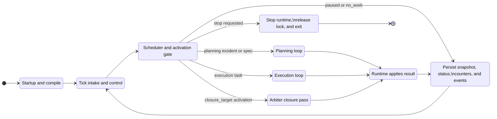

# Millrace Runtime Lifecycle Diagram

This is the dense, implementation-accurate lifecycle chart for the shipped
default runtime configuration:

- mode: `standard_plain`
- planning loop: `planning.standard`
- execution loop: `execution.standard`

The README embeds a simplified version. This file keeps the fuller chart that
tracks startup, scheduling, result application, recovery routing, and Arbiter
activation more faithfully.

## State Detail

### Startup and compile

1. Bootstrap workspace contract.
2. Load runtime config.
3. Acquire workspace lock.
4. Build watcher session.
5. Compile active mode and loops into a frozen plan.
6. Load snapshot and recovery counters.
7. Reconcile stale or impossible state.
8. Persist running snapshot and startup events.

### Tick intake and control

- Drain mailbox commands first on every tick.
- Explicit config reload is what recompiles the frozen plan.
- Consume watcher events and normalize ideas into queued specs.
- Refresh queue depths, run stop and pause checks, then reconcile.
- Refresh queue depths again before claim or activation.

### Scheduler and activation gate

- Exactly one stage runs per tick at most.
- Active stages can bypass fresh claim and go straight to request build.
- Planning claim precedence is incident -> spec -> task.
- Root-spec claim opens the closure target and snapshots contracts.
- Arbiter activates only when no lineage work remains and closure is ready.
- Invalid active state is cleared before the runtime settles on `no_work`.

### Planning loop

- Incident claim activates `auditor`.
- Spec claim activates `planner`.
- `AUDITOR_COMPLETE` routes to `planner`.
- `PLANNER_COMPLETE` routes to `manager`.
- Blocked planning routes into `mechanic` while attempts remain.
- `MECHANIC_COMPLETE` resumes the metadata target, default `planner`.
- `MANAGER_COMPLETE` returns to the idle or claim boundary.
- Exhausted mechanic attempts persist blocked planning state.

### Execution loop

- Task claim activates `builder`.
- `BUILDER_COMPLETE` routes to `checker`.
- `CHECKER_PASS` routes to `updater`.
- `FIX_NEEDED` routes to `fixer` while fix budget remains, else recovery.
- `FIXER_COMPLETE` routes to `doublechecker`.
- `DOUBLECHECK_PASS` routes to `updater`.
- Blocked execution routes into `troubleshooter`, then `consultant`.
- `TROUBLESHOOT_COMPLETE` resumes the metadata target, default `builder`.
- `CONSULT_COMPLETE` resumes the metadata target, default `troubleshooter`.
- `CONSULT NEEDS_PLANNING` enqueues a planning incident and clears active.
- `UPDATE_COMPLETE` returns to the idle or claim boundary.
- `CONSULT BLOCKED` persists blocked execution state.

### Arbiter closure pass

- `request_kind = closure_target`.
- Arbiter is a completion-behavior activation path, not queue work.
- `ARBITER_COMPLETE` closes the target and clears active.
- `REMEDIATION_NEEDED` keeps the target open and enqueues planning work.
- `BLOCKED` keeps the target open and persists blocked planning state.

### Runtime applies result

- Normalize and persist the stage result.
- Write stage-result artifacts.
- Route terminal status.
- Mark tasks, specs, or incidents done or blocked.
- Update recovery counters and closure-target state.
- The runtime, not the stage, owns authoritative state mutation.

Key invariants preserved by this chart:

- compile happens at startup and again only on explicit config reload
- planning and execution are separate claim domains inside one scheduler, not
  concurrent lanes
- the runtime applies stage results and mutates authoritative state after each
  execution; stages do not own queue mutation directly
- `manager`, `updater`, and successful Arbiter outcomes return the runtime to
  an idle or claim boundary for the next tick
- Arbiter is a completion-behavior activation path, not a normal queued work
  item handoff
